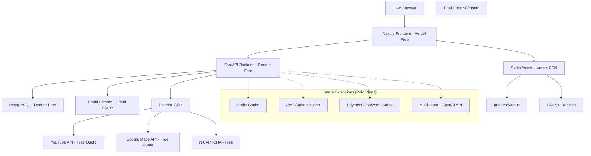
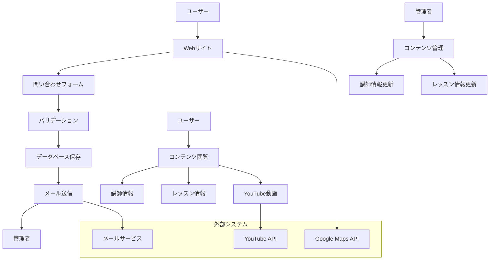
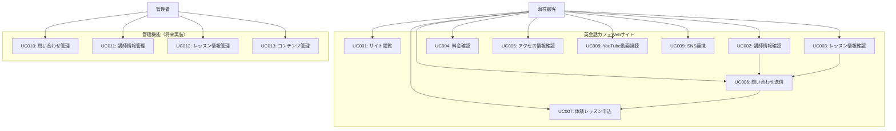
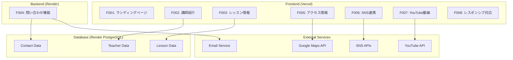
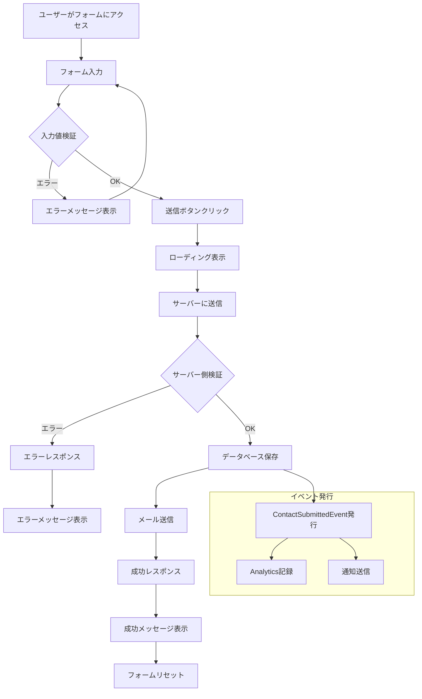
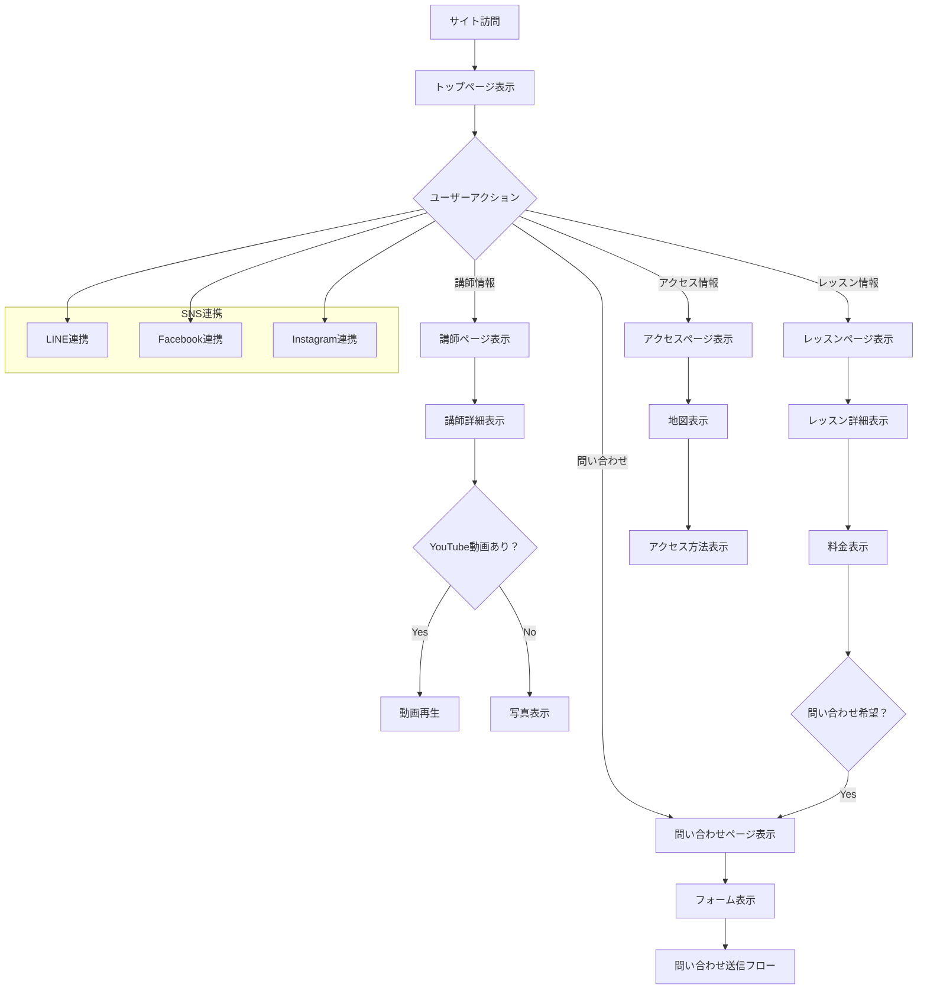

# Design Document

## Overview

英会話カフェの集客用Webサイトは、モダンなフロントエンド技術を使用したレスポンシブなマーケティングサイトとして設計する。サイトは高速で SEO に優れ、モバイルファーストのアプローチで構築し、将来的な機能拡張（ユーザー登録、予約システム、決済、AIチャットボット）に対応できる柔軟なアーキテクチャを採用する。

## Architecture

### Technology Selection Rationale

**フロントエンド - Next.js + TypeScript:**
- SEO最適化が重要なマーケティングサイトに最適
- 静的サイト生成（SSG）により高速表示とコスト削減を実現
- TypeScriptにより保守性とコード品質を向上
- Vercelの無料プランで十分なパフォーマンスを提供

**バックエンド - Python/FastAPI:**
- 将来実装予定のAIチャットボット機能との親和性が高い
- 豊富なPythonライブラリエコシステムを活用可能
- FastAPIの自動API文書生成により開発効率向上
- Pydanticによる型安全なデータバリデーション
- 非同期処理によるスケーラビリティ

**データベース - PostgreSQL:**
- 将来のユーザー管理、予約システムに対応
- ACID特性による信頼性の高いデータ管理
- 無料プランでも十分な機能を提供

**モノレポ構成:**
- 一元管理によるコード品質向上と開発効率化
- フロントエンドとバックエンドの型定義共有
- 設計書と実装の統合管理
- 単一リポジトリでのCI/CD設定

**コスト0デプロイ戦略:**
- フロントエンド: Vercel（無料プラン - 100GB帯域幅/月）
- バックエンド: Render（無料プラン - 750時間/月、スリープ機能あり）
- データベース: Render PostgreSQL（無料プラン - 1GB）
- コード管理: GitHub（無料プラン - プライベートリポジトリ無制限）
- 総コスト: $0/月（制限内利用時）

### Technology Stack

**フロントエンド:**
- Next.js 14.x (App Router) - React ベースのフレームワーク（静的サイト生成）
- React 18.x - UIライブラリ
- TypeScript 5.x - 型安全性とコード品質の向上
- Tailwind CSS 3.x - ユーティリティファーストのCSSフレームワーク
- Framer Motion 11.x - アニメーションライブラリ
- Zustand 4.x - 軽量状態管理ライブラリ

**React開発環境:**
- ESLint 8.x - JavaScriptリンター（@next/eslint-config-next）
- Prettier 3.x - コードフォーマッター
- Jest 29.x + React Testing Library 14.x - テストフレームワーク
- Playwright 1.x - E2Eテスト
- Husky 8.x + lint-staged 15.x - Git hooks（コミット前チェック）

**バックエンド:**
- Python 3.12 - プログラミング言語（最新安定版）
- uv - 高速Pythonパッケージマネージャー（Rustベース、pyproject.toml管理）
- FastAPI 0.104.x - 高速なWeb APIフレームワーク
- Pydantic 2.x - データバリデーション
- SQLAlchemy 2.x - ORM
- Alembic 1.x - データベースマイグレーション
- python-multipart 0.0.6 - ファイルアップロード対応
- python-jose 3.x - JWT認証（将来実装用）
- asyncpg 0.29.x - PostgreSQL非同期ドライバー

**Python開発環境:**
- Ruff 0.1.x - 高速リンター・フォーマッター
- pytest 7.x - テストフレームワーク
- pytest-asyncio 0.21.x - 非同期テスト対応
- httpx 0.25.x - テスト用HTTPクライアント

**データベース:**
- PostgreSQL 15.x - メインデータベース（最新安定版）
- Redis 7.x - セッション管理、キャッシュ（将来実装用）

**セキュリティライブラリ:**
- DOMPurify 3.x - XSS対策（フロントエンド）
- bcrypt 4.x - パスワードハッシュ化（将来実装用）
- python-jose 3.x - JWT処理
- slowapi 0.1.x - レート制限

**ホスティング・インフラ（無料プラン）:**
- Vercel - フロントエンド（Next.js静的サイト、無料プラン）
- Render - バックエンド（FastAPI、無料プラン）
- Render PostgreSQL - データベース（無料プラン、1GB）
- Google Analytics - ユーザー行動分析（無料）

**無料プラン制限事項:**
- Render無料プラン: 15分間非アクティブ後にスリープ（初回アクセス時に数秒の遅延）
- PostgreSQL: 1GBストレージ制限
- Vercel: 100GB帯域幅/月制限

**外部サービス連携:**
- YouTube API - 動画埋め込み
- Google Maps API - 地図表示
- reCAPTCHA - スパム防止
- Gmail SMTP - メール送信
- Sentry - エラー監視（将来実装）
- Google Analytics - アクセス解析

### Architecture Principles

**DDD + Clean Architecture + Event-Driven Design:**
- **ドメイン中心設計**: ビジネスロジックをドメインモデルに集約
- **境界づけられたコンテキスト**: 機能領域ごとの明確な境界
- **ドメインイベント**: 状態変更を非同期で他の機能に通知
- **依存関係の逆転**: 外部依存は内部ドメインに依存
- **イミュータブルな値オブジェクト**: データの整合性保証

**Simplified DDD Backend Architecture (FastAPI):**
```
backend/app/
├── domain/              # ドメイン層（エンティティ、値オブジェクト、イベント）
├── services/            # アプリケーションサービス（ユースケース）
├── repositories/        # データアクセス層
├── api/                # FastAPI エンドポイント
└── utils/              # ユーティリティ（イベントバス、外部サービス）
```

**Simplified Event-Driven Frontend Architecture (Next.js):**
```
frontend/src/
├── domain/              # ドメイン層（エンティティ、イベント）
├── services/            # アプリケーションサービス
├── stores/              # 状態管理（Zustand）
├── components/          # UI コンポーネント
├── app/                # App Router (Next.js 14)
└── utils/              # ユーティリティ（API、イベントバス）
```

### Project Structure (Monorepo)

```
english-cafe-website/
├── .kiro/                    # Kiro設定・仕様書
│   └── specs/
├── frontend/                 # Next.js フロントエンド
│   ├── src/
│   │   ├── app/             # App Router (Next.js 14)
│   │   ├── components/      # UI コンポーネント
│   │   ├── domain/          # ドメイン層（エンティティ、イベント）
│   │   ├── services/        # アプリケーションサービス
│   │   ├── stores/          # 状態管理（Zustand）
│   │   └── utils/           # ユーティリティ（API、イベントバス）
│   ├── public/             # 静的ファイル
│   ├── package.json
│   └── vercel.json         # Vercelデプロイ設定
├── backend/                 # FastAPI バックエンド
│   ├── app/
│   │   ├── api/            # FastAPI エンドポイント
│   │   ├── domain/         # ドメイン層（エンティティ、値オブジェクト、イベント）
│   │   ├── repositories/   # データアクセス層
│   │   ├── services/       # アプリケーションサービス（ユースケース）
│   │   └── utils/          # ユーティリティ（イベントバス、外部サービス）
│   ├── tests/              # テストコード
│   ├── alembic/            # DBマイグレーション
│   ├── requirements.txt
│   └── render.yaml         # Renderデプロイ設定
├── shared/                  # 共通型定義・設定
│   ├── types/              # 共通TypeScript型
│   └── constants/          # 定数定義
├── docs/                   # ドキュメント
├── .github/                # GitHub Actions
│   └── workflows/
├── README.md
└── package.json            # ルートpackage.json
```

### Deployment Configuration

**GitHub → Vercel (Frontend):**
```json
// vercel.json
{
  "buildCommand": "cd frontend && npm run build",
  "outputDirectory": "frontend/.next",
  "installCommand": "cd frontend && npm install"
}
```

**GitHub → Render (Backend):**
```yaml
# render.yaml
services:
  - type: web
    name: english-cafe-api
    env: python
    runtime: python-3.12
    buildCommand: "cd backend && pip install -r requirements.txt"
    startCommand: "cd backend && uvicorn app.main:app --host 0.0.0.0 --port $PORT"
```

**Docker Configuration:**
```dockerfile
# backend/Dockerfile
FROM python:3.12-slim

WORKDIR /app
COPY requirements.txt .
RUN pip install --no-cache-dir -r requirements.txt

COPY . .
CMD ["uvicorn", "app.main:app", "--host", "0.0.0.0", "--port", "8000", "--reload"]

# frontend/Dockerfile  
FROM node:20-alpine

WORKDIR /app
COPY package*.json ./
RUN npm ci

COPY . .
CMD ["npm", "run", "dev"]
```

### Architecture Diagram



## Components and Interfaces

### Page Structure

1. **Homepage (`/`)**
   - Hero Section
   - Service Overview
   - Featured Teachers
   - Customer Reviews
   - Contact Information

2. **About Page (`/about`)**
   - Cafe Story
   - Teaching Philosophy
   - Facility Photos

3. **Teachers Page (`/teachers`)**
   - Teacher Profiles
   - Specializations
   - Teaching Experience

4. **Lessons Page (`/lessons`)**
   - Lesson Types
   - Pricing
   - Schedule Information

5. **Contact Page (`/contact`)**
   - Contact Form
   - Location Map
   - SNS Links
   - Business Hours

### DDD + Event-Driven Implementation Examples

**Backend - Contact Bounded Context:**
```python
# domain/contact.py (エンティティ、値オブジェクト、イベントを統合)
from dataclasses import dataclass
from datetime import datetime
import re

@dataclass(frozen=True)
class Email:
    value: str
    
    def __post_init__(self):
        if not re.match(r'^[^\s@]+@[^\s@]+\.[^\s@]+$', self.value):
            raise ValueError("無効なメールアドレスです")
    
    def __str__(self):
        return self.value

@dataclass
class ContactSubmittedEvent:
    contact_id: int
    email: str
    submitted_at: datetime

@dataclass
class Contact:
    name: str
    email: Email
    message: str
    phone: str | None = None
    lesson_type: str | None = None
    preferred_contact: str = "email"
    submitted_at: datetime | None = None
    
    def __post_init__(self):
        if not self.submitted_at:
            self.submitted_at = datetime.now()
    
    def submit(self) -> ContactSubmittedEvent:
        """お問い合わせ送信時のドメインイベント発行"""
        return ContactSubmittedEvent(
            contact_id=id(self),
            email=str(self.email),
            submitted_at=self.submitted_at
        )

# services/contact_service.py
from domain.contact import Contact, Email, ContactSubmittedEvent
from repositories.contact_repository import ContactRepository
from utils.event_bus import EventBus

class ContactService:
    def __init__(self, contact_repo: ContactRepository, event_bus: EventBus):
        self.contact_repo = contact_repo
        self.event_bus = event_bus
    
    async def submit_contact(self, contact_data: dict) -> Contact:
        # ドメインオブジェクト作成
        contact = Contact(
            name=contact_data["name"],
            email=Email(contact_data["email"]),
            message=contact_data["message"],
            phone=contact_data.get("phone"),
            lesson_type=contact_data.get("lesson_type"),
            preferred_contact=contact_data.get("preferred_contact", "email")
        )
        
        # 永続化
        saved_contact = await self.contact_repo.save(contact)
        
        # ドメインイベント発行
        event = contact.submit()
        await self.event_bus.publish(event)
        
        return saved_contact
```

**Frontend - Event-Driven State Management:**
```typescript
// domain/contact.ts (エンティティとイベントを統合)
export class Contact {
  constructor(
    public readonly name: string,
    public readonly email: string,
    public readonly message: string,
    public readonly phone?: string,
    public readonly lessonType?: string,
    public readonly preferredContact: string = 'email'
  ) {
    this.validateEmail(email);
  }
  
  private validateEmail(email: string): void {
    const emailRegex = /^[^\s@]+@[^\s@]+\.[^\s@]+$/;
    if (!emailRegex.test(email)) {
      throw new Error('無効なメールアドレスです');
    }
  }
  
  submit(): ContactSubmittedEvent {
    return {
      type: 'CONTACT_SUBMITTED',
      payload: {
        contactId: crypto.randomUUID(),
        email: this.email,
        submittedAt: new Date()
      }
    };
  }
}

export interface ContactSubmittedEvent {
  type: 'CONTACT_SUBMITTED';
  payload: {
    contactId: string;
    email: string;
    submittedAt: Date;
  };
}

// stores/contactStore.ts (Zustand)
import { create } from 'zustand';
import { Contact } from '@/domain/contact';
import { eventBus } from '@/utils/eventBus';

interface ContactState {
  isSubmitting: boolean;
  error: string | null;
  submitContact: (contactData: any) => Promise<void>;
}

export const useContactStore = create<ContactState>((set, get) => ({
  isSubmitting: false,
  error: null,
  
  submitContact: async (contactData) => {
    set({ isSubmitting: true, error: null });
    
    try {
      // ドメインオブジェクト作成
      const contact = new Contact(
        contactData.name,
        contactData.email,
        contactData.message,
        contactData.phone,
        contactData.lessonType,
        contactData.preferredContact
      );
      
      // API呼び出し
      const response = await fetch('/api/contact', {
        method: 'POST',
        headers: { 'Content-Type': 'application/json' },
        body: JSON.stringify(contact),
      });
      
      if (!response.ok) {
        throw new Error('送信に失敗しました');
      }
      
      // 成功イベント発行
      const event = contact.submit();
      eventBus.emit(event.type, event.payload);
      
    } catch (error) {
      set({ error: error instanceof Error ? error.message : 'エラーが発生しました' });
    } finally {
      set({ isSubmitting: false });
    }
  }
}));

// utils/eventBus.ts
type EventHandler<T = any> = (payload: T) => void;

class EventBus {
  private handlers: Map<string, EventHandler[]> = new Map();
  
  emit<T>(eventType: string, payload: T): void {
    const eventHandlers = this.handlers.get(eventType) || [];
    eventHandlers.forEach(handler => handler(payload));
  }
  
  on<T>(eventType: string, handler: EventHandler<T>): void {
    const handlers = this.handlers.get(eventType) || [];
    handlers.push(handler);
    this.handlers.set(eventType, handlers);
  }
}

export const eventBus = new EventBus();
```

## System Analysis and Design

### Data Flow Diagram (DFD)



### CRUD Matrix

| エンティティ | Create | Read | Update | Delete | 担当者 | 備考 |
|-------------|--------|------|--------|--------|--------|------|
| Contact | ✓ | ✓ | ✓ | ✓ | システム/管理者 | 問い合わせフォーム送信 |
| Teacher | ✓ | ✓ | ✓ | ✓ | 管理者 | 講師プロフィール管理 |
| Lesson | ✓ | ✓ | ✓ | ✓ | 管理者 | レッスン情報管理 |
| Review | ✓ | ✓ | ✓ | ✓ | 管理者/顧客 | 顧客は作成のみ、管理者は承認・編集 |
| Content | ✓ | ✓ | ✓ | ✓ | 管理者 | サイトコンテンツ管理 |
| SNSConfig | ✓ | ✓ | ✓ | ✓ | 管理者 | SNSアカウント情報管理 |

### Use Case List

**アクター: 潜在顧客**
1. UC001: サイト閲覧
2. UC002: 講師情報確認
3. UC003: レッスン情報確認
4. UC004: 料金確認
5. UC005: アクセス情報確認
6. UC006: 問い合わせ送信
7. UC007: 体験レッスン申込
8. UC008: YouTube動画視聴
9. UC009: SNS連携

**アクター: 管理者（将来実装）**
10. UC010: 問い合わせ管理
11. UC011: 講師情報管理
12. UC012: レッスン情報管理
13. UC013: コンテンツ管理

### Use Case Diagram



### Feature List

**Phase 1: 集客サイト（初期実装）**
1. **F001: ランディングページ**
   - ヒーローセクション
   - サービス概要
   - 特徴紹介

2. **F002: 講師紹介**
   - 講師プロフィール表示
   - 専門分野・経歴表示
   - 講師写真表示

3. **F003: レッスン情報**
   - レッスンタイプ説明
   - 料金表示
   - スケジュール情報

4. **F004: 問い合わせ機能**
   - 問い合わせフォーム
   - バリデーション
   - メール送信
   - 確認画面

5. **F005: アクセス情報**
   - 住所・営業時間表示
   - Google Maps埋め込み
   - アクセス方法説明

6. **F006: SNS連携**
   - LINE公式アカウント連携（QRコード表示機能含む）
   - Facebook連携（ページリンク・メッセンジャー）
   - Instagram連携（アカウントリンク・DM機能）
   - SNSアイコンクリック時の適切なリダイレクト

7. **F007: YouTube動画**
   - レッスン風景動画
   - 講師紹介動画
   - カフェ紹介動画

8. **F008: レスポンシブ対応**
   - モバイル最適化
   - タブレット対応
   - デスクトップ対応

**Phase 2: 将来拡張**
9. **F009: ユーザー登録**
10. **F010: レッスン予約**
11. **F011: 決済機能**
12. **F012: AIチャットボット**

### Feature Deployment Diagram



### Activity Diagram - Contact Form Submission



### Activity Diagram - Site Navigation



### YouTube Video Integration

```typescript
interface YouTubeEmbedProps {
  videoId: string;
  title: string;
  autoplay?: boolean;
  controls?: boolean;
}

// YouTube動画の埋め込みコンポーネント
const YouTubeEmbed: React.FC<YouTubeEmbedProps> = ({
  videoId,
  title,
  autoplay = false,
  controls = true
}) => {
  return (
    <div className="aspect-video">
      <iframe
        src={`https://www.youtube.com/embed/${videoId}?autoplay=${autoplay ? 1 : 0}&controls=${controls ? 1 : 0}`}
        title={title}
        allow="accelerometer; autoplay; clipboard-write; encrypted-media; gyroscope; picture-in-picture"
        allowFullScreen
        className="w-full h-full rounded-lg"
      />
    </div>
  );
};
```

### SNS Integration Components

```typescript
// LINE QRコード表示コンポーネント
interface LineQRCodeProps {
  lineId: string;
  size?: number;
}

const LineQRCode: React.FC<LineQRCodeProps> = ({ lineId, size = 200 }) => {
  const qrCodeUrl = `https://qr-official.line.me/gs/${lineId}`;
  
  return (
    <div className="flex flex-col items-center space-y-2">
      
      <p className="text-sm text-gray-600">LINEで友達追加</p>
    </div>
  );
};

// SNSリンクコンポーネント
interface SNSLinksProps {
  lineId?: string;
  facebookUrl?: string;
  instagramUrl?: string;
}

const SNSLinks: React.FC<SNSLinksProps> = ({ lineId, facebookUrl, instagramUrl }) => {
  return (
    <div className="flex space-x-4">
      {lineId && (
        <a 
          href={`https://line.me/R/ti/p/@${lineId}`}
          target="_blank"
          rel="noopener noreferrer"
          className="flex items-center space-x-2 bg-green-500 text-white px-4 py-2 rounded-lg hover:bg-green-600"
        >
          <LineIcon />
          <span>LINEで問い合わせ</span>
        </a>
      )}
      {facebookUrl && (
        <a 
          href={facebookUrl}
          target="_blank"
          rel="noopener noreferrer"
          className="flex items-center space-x-2 bg-blue-600 text-white px-4 py-2 rounded-lg hover:bg-blue-700"
        >
          <FacebookIcon />
          <span>Facebook</span>
        </a>
      )}
      {instagramUrl && (
        <a 
          href={instagramUrl}
          target="_blank"
          rel="noopener noreferrer"
          className="flex items-center space-x-2 bg-gradient-to-r from-purple-500 to-pink-500 text-white px-4 py-2 rounded-lg hover:from-purple-600 hover:to-pink-600"
        >
          <InstagramIcon />
          <span>Instagram</span>
        </a>
      )}
    </div>
  );
};
```

## Data Models

### Contact Form Data Model

```typescript
interface ContactSubmission {
  id: string;
  name: string;
  email: string;
  phone?: string;
  message: string;
  lessonType?: 'group' | 'private' | 'trial' | 'other';
  preferredContact: 'email' | 'phone' | 'line' | 'facebook' | 'instagram';
  submittedAt: Date;
  status: 'pending' | 'responded' | 'archived';
}
```

### Content Data Models

```typescript
interface Teacher {
  id: string;
  name: string;
  photo: string;
  nationality: string;
  languages: string[];
  specialization: string[];
  experience: string;
  introduction: string;
  certifications?: string[];
}

interface Lesson {
  id: string;
  title: string;
  description: string;
  type: 'group' | 'private' | 'trial';
  price: {
    amount: number;
    currency: 'JPY';
    period: 'per_lesson' | 'monthly';
  };
  duration: number; // minutes
  maxStudents?: number;
  level: string[];
  features: string[];
}

interface Review {
  id: string;
  studentName: string;
  rating: number; // 1-5 stars
  comment: string;
  lessonType: 'group' | 'private' | 'trial';
  submittedAt: Date;
  isPublished: boolean;
  teacherId?: string; // 特定の講師への評価
  helpfulCount: number; // 他のユーザーからの「参考になった」数
  verified: boolean; // 実際の受講生かどうかの検証済みフラグ
}

// 管理機能用データモデル
interface AdminUser {
  id: string;
  username: string;
  email: string;
  role: 'admin' | 'staff';
  lastLogin: Date;
  isActive: boolean;
}

interface SystemLog {
  id: string;
  level: 'info' | 'warning' | 'error' | 'critical';
  message: string;
  timestamp: Date;
  source: string;
  userId?: string;
  metadata?: Record<string, any>;
}
```

## Error Handling

### Client-Side Error Handling

```typescript
// Error Boundary for React components
class ErrorBoundary extends React.Component {
  constructor(props) {
    super(props);
    this.state = { hasError: false };
  }

  static getDerivedStateFromError(error) {
    return { hasError: true };
  }

  componentDidCatch(error, errorInfo) {
    console.error('Error caught by boundary:', error, errorInfo);
  }

  render() {
    if (this.state.hasError) {
      return <ErrorFallback />;
    }
    return this.props.children;
  }
}

// Form validation errors
interface FormErrors {
  name?: string;
  email?: string;
  message?: string;
}

const validateContactForm = (data: ContactFormData): FormErrors => {
  const errors: FormErrors = {};
  
  if (!data.name.trim()) {
    errors.name = 'お名前は必須です';
  }
  
  if (!data.email.trim()) {
    errors.email = 'メールアドレスは必須です';
  } else if (!/^[^\s@]+@[^\s@]+\.[^\s@]+$/.test(data.email)) {
    errors.email = '有効なメールアドレスを入力してください';
  }
  
  if (!data.message.trim()) {
    errors.message = 'メッセージは必須です';
  }
  
  return errors;
};
```

### Server-Side Error Handling

```python
# FastAPI error handling
from fastapi import FastAPI, HTTPException, status
from fastapi.responses import JSONResponse
from pydantic import BaseModel, ValidationError
import logging

app = FastAPI()

class ContactForm(BaseModel):
    name: str
    email: str
    phone: str = None
    message: str
    lesson_type: str = None
    preferred_contact: str

@app.exception_handler(ValidationError)
async def validation_exception_handler(request, exc):
    return JSONResponse(
        status_code=status.HTTP_400_BAD_REQUEST,
        content={"success": False, "errors": exc.errors()}
    )

@app.post("/api/contact")
async def submit_contact_form(form_data: ContactForm):
    try:
        # Process form submission
        await send_contact_email(form_data)
        
        return {"success": True, "message": "お問い合わせを受け付けました"}
        
    except Exception as e:
        logging.error(f"Contact form error: {e}")
        raise HTTPException(
            status_code=status.HTTP_500_INTERNAL_SERVER_ERROR,
            detail="サーバーエラーが発生しました"
        )
```

## Testing Strategy

### Unit Testing
- **Framework:** Jest + React Testing Library
- **Coverage:** Components, utility functions, form validation
- **Test Files:** `__tests__` directories alongside components

### Integration Testing
- **API Routes:** Test form submission and email sending
- **Component Integration:** Test component interactions and data flow

### End-to-End Testing
- **Framework:** Playwright
- **Scenarios:**
  - Contact form submission flow
  - Navigation between pages
  - Mobile responsiveness
  - YouTube video loading

### Performance Testing
- **Lighthouse CI:** Automated performance audits
- **Core Web Vitals:** Monitor LCP, FID, CLS
- **Bundle Analysis:** Monitor JavaScript bundle sizes

### Development Environment Configuration

**Python設定 (backend/):**
```toml
# pyproject.toml
[tool.ruff]
target-version = "py311"
line-length = 88
select = ["E", "F", "I", "N", "W", "UP"]

[tool.ruff.format]
quote-style = "double"
indent-style = "space"

[tool.pytest.ini_options]
testpaths = ["tests"]
python_files = ["test_*.py"]
python_classes = ["Test*"]
python_functions = ["test_*"]
asyncio_mode = "auto"
```

**React設定 (frontend/):**
```json
// .eslintrc.json
{
  "extends": ["next/core-web-vitals", "prettier"],
  "rules": {
    "@typescript-eslint/no-unused-vars": "error",
    "prefer-const": "error"
  }
}

// prettier.config.js
module.exports = {
  semi: true,
  singleQuote: true,
  tabWidth: 2,
  trailingComma: 'es5'
};
```

### Testing Configuration

**Frontend Tests:**
```typescript
// jest.config.js
module.exports = {
  testEnvironment: 'jsdom',
  setupFilesAfterEnv: ['<rootDir>/jest.setup.js'],
  moduleNameMapping: {
    '^@/(.*)$': '<rootDir>/src/$1',
  },
  collectCoverageFrom: [
    'src/**/*.{js,jsx,ts,tsx}',
    '!src/**/*.d.ts',
  ],
};

// Example component test
describe('ContactForm', () => {
  it('should submit form with valid data', async () => {
    render(<ContactForm onSubmit={mockSubmit} />);
    
    await user.type(screen.getByLabelText('お名前'), '田中太郎');
    await user.type(screen.getByLabelText('メールアドレス'), 'tanaka@example.com');
    await user.type(screen.getByLabelText('メッセージ'), 'お問い合わせです');
    
    await user.click(screen.getByRole('button', { name: '送信' }));
    
    expect(mockSubmit).toHaveBeenCalledWith({
      name: '田中太郎',
      email: 'tanaka@example.com',
      message: 'お問い合わせです',
    });
  });
});
```

**Backend Tests:**
```python
# tests/test_contact_api.py
import pytest
from httpx import AsyncClient
from app.main import app

@pytest.mark.asyncio
async def test_submit_contact_form():
    async with AsyncClient(app=app, base_url="http://test") as client:
        response = await client.post("/api/contact", json={
            "name": "田中太郎",
            "email": "tanaka@example.com",
            "message": "お問い合わせです",
            "preferred_contact": "email"
        })
    
    assert response.status_code == 200
    assert response.json()["success"] is True
```

### SEO and Performance Optimization

```typescript
// Next.js metadata configuration
export const metadata: Metadata = {
  title: '英会話カフェ | ネイティブ講師との楽しい英会話レッスン',
  description: '東京の英会話カフェで、ネイティブ講師と楽しく英会話を学びませんか？初心者から上級者まで、あなたのレベルに合わせたレッスンを提供します。',
  keywords: '英会話, カフェ, ネイティブ講師, 東京, 英語学習',
  openGraph: {
    title: '英会話カフェ | ネイティブ講師との楽しい英会話レッスン',
    description: '東京の英会話カフェで、ネイティブ講師と楽しく英会話を学びませんか？',
    images: ['/og-image.jpg'],
  },
};

// Image optimization
import Image from 'next/image';

const OptimizedImage = ({ src, alt, ...props }) => (
  <Image
    src={src}
    alt={alt}
    loading="lazy"
    placeholder="blur"
    blurDataURL="data:image/jpeg;base64,..."
    {...props}
  />
);
```