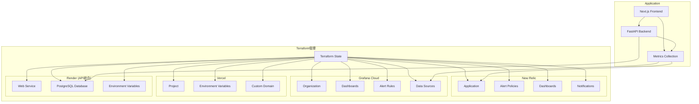

# Terraform監視インフラ設計書

## 概要

英会話カフェWebサイトのGrafanaとNew Relicの監視環境をTerraformで管理するための設計書です。Infrastructure as Code（IaC）により、監視環境の構築・管理を自動化し、再現性と保守性を向上させます。

## アーキテクチャ概要



## ディレクトリ構造

```
terraform/
├── environments/
│   ├── dev/
│   │   ├── main.tf
│   │   ├── variables.tf
│   │   └── terraform.tfvars
│   ├── staging/
│   │   ├── main.tf
│   │   ├── variables.tf
│   │   └── terraform.tfvars
│   └── prod/
│       ├── main.tf
│       ├── variables.tf
│       └── terraform.tfvars
├── modules/
│   ├── newrelic/
│   │   ├── main.tf
│   │   ├── variables.tf
│   │   ├── outputs.tf
│   │   └── versions.tf
│   ├── grafana/
│   │   ├── main.tf
│   │   ├── variables.tf
│   │   ├── outputs.tf
│   │   └── versions.tf
│   └── monitoring-common/
│       ├── main.tf
│       ├── variables.tf
│       ├── outputs.tf
│       └── versions.tf
├── shared/
│   ├── backend.tf
│   ├── providers.tf
│   └── variables.tf
└── scripts/
    ├── deploy.sh
    ├── destroy.sh
    └── validate.sh
```

## モジュール設計

### 1. New Relic モジュール

#### 管理対象リソース
- **Application**: アプリケーション登録
- **Alert Policies**: アラートポリシー
- **Alert Conditions**: アラート条件
- **Notification Channels**: 通知チャンネル
- **Dashboards**: ダッシュボード
- **Workloads**: ワークロード管理

#### 主要機能
```hcl
# New Relic Application
resource "newrelic_application" "english_cafe" {
  name     = var.application_name
  language = "javascript"
  
  app_apdex_threshold      = 0.5
  end_user_apdex_threshold = 7
  enable_real_user_monitoring = true
  
  tags = var.common_tags
}

# Alert Policy
resource "newrelic_alert_policy" "performance" {
  name                = "${var.application_name}-performance"
  incident_preference = "PER_CONDITION_AND_TARGET"
}

# Alert Conditions
resource "newrelic_alert_condition" "high_error_rate" {
  policy_id = newrelic_alert_policy.performance.id
  
  name        = "High Error Rate"
  type        = "apm_app_metric"
  entities    = [newrelic_application.english_cafe.id]
  metric      = "error_percentage"
  runbook_url = var.runbook_url
  
  term {
    duration      = 5
    operator      = "above"
    priority      = "critical"
    threshold     = "5"
    time_function = "all"
  }
}
```

### 2. Grafana モジュール

#### 管理対象リソース
- **Organization**: 組織設定
- **Data Sources**: データソース（Prometheus、Loki等）
- **Dashboards**: ダッシュボード
- **Alert Rules**: アラートルール
- **Notification Policies**: 通知ポリシー
- **Folders**: フォルダ管理

#### 主要機能
```hcl
# Grafana Organization
resource "grafana_organization" "english_cafe" {
  name         = var.organization_name
  admin_user   = var.admin_email
  create_users = true
  
  admins  = var.admin_users
  editors = var.editor_users
  viewers = var.viewer_users
}

# Data Source - Prometheus
resource "grafana_data_source" "prometheus" {
  type = "prometheus"
  name = "Prometheus"
  url  = var.prometheus_url
  
  basic_auth_enabled  = true
  basic_auth_username = var.prometheus_username
  
  json_data_encoded = jsonencode({
    httpMethod   = "POST"
    timeInterval = "30s"
  })
  
  secure_json_data_encoded = jsonencode({
    basicAuthPassword = var.prometheus_password
  })
}

# Dashboard
resource "grafana_dashboard" "performance" {
  config_json = file("${path.module}/dashboards/performance.json")
  folder      = grafana_folder.monitoring.id
  
  depends_on = [grafana_data_source.prometheus]
}
```

### 3. 共通モジュール

#### 管理対象リソース
- **Secrets Management**: API キー等の機密情報
- **IAM Roles**: 必要な権限設定
- **Tagging**: 共通タグ管理
- **Networking**: 必要に応じてVPC設定

## 環境別設定

### Development環境
```hcl
# environments/dev/terraform.tfvars
environment = "dev"
application_name = "english-cafe-dev"

# New Relic設定
newrelic_account_id = "your-account-id"
newrelic_api_key = "your-api-key"

# Grafana設定
grafana_url = "https://your-org.grafana.net"
grafana_auth = "your-service-account-token"

# アラート設定（開発環境は緩い設定）
alert_thresholds = {
  error_rate = 10
  response_time = 5000
  memory_usage = 90
}

# 通知設定
notification_channels = {
  slack_dev = "https://hooks.slack.com/dev-channel"
}
```

### Production環境
```hcl
# environments/prod/terraform.tfvars
environment = "prod"
application_name = "english-cafe-prod"

# New Relic設定
newrelic_account_id = "your-account-id"
newrelic_api_key = "your-api-key"

# Grafana設定
grafana_url = "https://your-org.grafana.net"
grafana_auth = "your-service-account-token"

# アラート設定（本番環境は厳しい設定）
alert_thresholds = {
  error_rate = 2
  response_time = 2000
  memory_usage = 80
}

# 通知設定
notification_channels = {
  slack_prod = "https://hooks.slack.com/prod-channel"
  email = "admin@english-cafe.com"
  pagerduty = "your-pagerduty-key"
}
```

## セキュリティ設計

### 1. 機密情報管理
```hcl
# AWS Secrets Manager
resource "aws_secretsmanager_secret" "monitoring_secrets" {
  name = "${var.environment}/monitoring/secrets"
  
  tags = var.common_tags
}

resource "aws_secretsmanager_secret_version" "monitoring_secrets" {
  secret_id = aws_secretsmanager_secret.monitoring_secrets.id
  
  secret_string = jsonencode({
    newrelic_api_key = var.newrelic_api_key
    grafana_token = var.grafana_token
    slack_webhook = var.slack_webhook
  })
}
```

### 2. IAM権限設計
```hcl
# Terraform実行用IAMロール
resource "aws_iam_role" "terraform_monitoring" {
  name = "${var.environment}-terraform-monitoring"
  
  assume_role_policy = jsonencode({
    Version = "2012-10-17"
    Statement = [
      {
        Action = "sts:AssumeRole"
        Effect = "Allow"
        Principal = {
          Service = "ec2.amazonaws.com"
        }
      }
    ]
  })
}

# 必要最小限の権限
resource "aws_iam_role_policy" "terraform_monitoring" {
  name = "${var.environment}-terraform-monitoring"
  role = aws_iam_role.terraform_monitoring.id
  
  policy = jsonencode({
    Version = "2012-10-17"
    Statement = [
      {
        Effect = "Allow"
        Action = [
          "secretsmanager:GetSecretValue",
          "secretsmanager:DescribeSecret"
        ]
        Resource = aws_secretsmanager_secret.monitoring_secrets.arn
      }
    ]
  })
}
```

## 状態管理設計

### 1. Remote State
```hcl
# shared/backend.tf
terraform {
  backend "s3" {
    bucket         = "english-cafe-terraform-state"
    key            = "monitoring/${var.environment}/terraform.tfstate"
    region         = "ap-northeast-1"
    encrypt        = true
    dynamodb_table = "terraform-state-lock"
  }
}
```

### 2. State Locking
```hcl
# DynamoDB for state locking
resource "aws_dynamodb_table" "terraform_state_lock" {
  name           = "terraform-state-lock"
  billing_mode   = "PAY_PER_REQUEST"
  hash_key       = "LockID"
  
  attribute {
    name = "LockID"
    type = "S"
  }
  
  tags = {
    Name = "Terraform State Lock Table"
  }
}
```

## CI/CD統合

### 1. GitHub Actions
```yaml
# .github/workflows/terraform-monitoring.yml
name: Terraform Monitoring

on:
  push:
    branches: [main]
    paths: ['terraform/**']
  pull_request:
    paths: ['terraform/**']

jobs:
  terraform:
    runs-on: ubuntu-latest
    
    strategy:
      matrix:
        environment: [dev, staging, prod]
    
    steps:
      - uses: actions/checkout@v3
      
      - name: Setup Terraform
        uses: hashicorp/setup-terraform@v2
        with:
          terraform_version: 1.6.0
      
      - name: Terraform Init
        run: |
          cd terraform/environments/${{ matrix.environment }}
          terraform init
      
      - name: Terraform Plan
        run: |
          cd terraform/environments/${{ matrix.environment }}
          terraform plan -out=tfplan
      
      - name: Terraform Apply
        if: github.ref == 'refs/heads/main'
        run: |
          cd terraform/environments/${{ matrix.environment }}
          terraform apply tfplan
```

### 2. 自動デプロイスクリプト
```bash
#!/bin/bash
# scripts/deploy.sh

set -e

ENVIRONMENT=${1:-dev}
ACTION=${2:-plan}

echo "🚀 Deploying monitoring infrastructure for $ENVIRONMENT"

cd "terraform/environments/$ENVIRONMENT"

# Initialize Terraform
terraform init

# Validate configuration
terraform validate

# Plan changes
terraform plan -out=tfplan

if [ "$ACTION" = "apply" ]; then
    echo "📋 Applying changes..."
    terraform apply tfplan
    
    echo "✅ Deployment completed successfully!"
    
    # Output important values
    echo "📊 Monitoring URLs:"
    terraform output monitoring_urls
else
    echo "📋 Plan completed. Run with 'apply' to execute changes."
fi
```

## 監視対象の定義

### 1. SLI/SLO定義
```hcl
# SLI/SLO設定
locals {
  slis = {
    availability = {
      description = "Service availability"
      threshold = 99.9
      measurement_window = "30d"
    }
    
    performance = {
      description = "Page load time"
      threshold = 2000  # ms
      measurement_window = "7d"
    }
    
    error_rate = {
      description = "Error rate"
      threshold = 1  # %
      measurement_window = "1h"
    }
  }
}
```

### 2. アラート階層
```hcl
# アラート重要度
locals {
  alert_severity = {
    critical = {
      escalation_time = 0
      notification_channels = ["pagerduty", "slack", "email"]
    }
    
    warning = {
      escalation_time = 300  # 5分
      notification_channels = ["slack", "email"]
    }
    
    info = {
      escalation_time = 1800  # 30分
      notification_channels = ["slack"]
    }
  }
}
```

## コスト最適化

### 1. リソース管理
```hcl
# 開発環境は夜間停止
resource "aws_lambda_function" "cost_optimizer" {
  count = var.environment == "dev" ? 1 : 0
  
  filename         = "cost_optimizer.zip"
  function_name    = "${var.environment}-monitoring-cost-optimizer"
  role            = aws_iam_role.lambda_role.arn
  handler         = "index.handler"
  runtime         = "python3.9"
  
  environment {
    variables = {
      ENVIRONMENT = var.environment
    }
  }
}
```

### 2. 使用量監視
```hcl
# コスト監視アラート
resource "aws_budgets_budget" "monitoring_cost" {
  name         = "${var.environment}-monitoring-budget"
  budget_type  = "COST"
  limit_amount = var.monthly_budget_limit
  limit_unit   = "USD"
  time_unit    = "MONTHLY"
  
  cost_filters = {
    Service = ["Amazon CloudWatch", "AWS Lambda"]
  }
  
  notification {
    comparison_operator        = "GREATER_THAN"
    threshold                 = 80
    threshold_type            = "PERCENTAGE"
    notification_type         = "ACTUAL"
    subscriber_email_addresses = [var.admin_email]
  }
}
```

## 運用手順

### 1. 初回セットアップ
```bash
# 1. リポジトリクローン
git clone <repository-url>
cd terraform

# 2. 環境変数設定
cp .env.example .env
# .envファイルを編集

# 3. 初期化
./scripts/deploy.sh dev plan

# 4. 適用
./scripts/deploy.sh dev apply
```

### 2. 日常運用
```bash
# 設定変更の適用
./scripts/deploy.sh prod plan
./scripts/deploy.sh prod apply

# 設定の検証
./scripts/validate.sh

# 緊急時のロールバック
terraform workspace select prod
terraform plan -destroy
```

### 3. トラブルシューティング
```bash
# 状態確認
terraform show

# リソース一覧
terraform state list

# 特定リソースの詳細
terraform state show <resource_name>

# 状態の修復
terraform refresh
```

## 拡張性設計

### 1. 新しい監視ツール追加
```hcl
# modules/datadog/
# modules/prometheus/
# modules/elastic/
```

### 2. マルチクラウド対応
```hcl
# providers/aws/
# providers/gcp/
# providers/azure/
```

### 3. 自動スケーリング
```hcl
# Auto-scaling based on metrics
resource "aws_autoscaling_policy" "monitoring_scale_up" {
  name                   = "${var.environment}-monitoring-scale-up"
  scaling_adjustment     = 1
  adjustment_type        = "ChangeInCapacity"
  cooldown              = 300
  autoscaling_group_name = aws_autoscaling_group.monitoring.name
}
```

この設計により、監視インフラの構築・管理が自動化され、環境間の一貫性と再現性が確保されます。